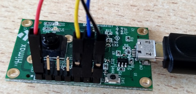

# What's that smell workshop

This repo contains the example applications for the [workshop](https://www.edgeimpulse.com/blog/ai-workshop-whats-that-smell) with Sparkfun Qwiic Environmental Combo breakout and Himax WE-I Plus devboard.

**Hardware requirements**

* [Sparkfun environmental breakout](https://www.sparkfun.com/products/14348)
* [Himax WE-I Plus](https://www.sparkfun.com/products/17256)

_**Note from [datasheet](https://cdn.sparkfun.com/assets/2/c/c/6/5/CN04-2019_attachment_CCS811_Datasheet_v1-06.pdf)**: CCS811 performance in terms of resistance levels and sensitivities will change during early life. The change in resistance is greatest over the first 48 hours of operation. CCS811 controls the burn-in period allowing eCO2 and eTVOC readings to be used from first power-on after 60 minutes of operation._

**How to connect Himax WE-I Plus to the Sparkfun breakout board**

You can load the _read-sensor_ firmware to start the burn-in period.

**Software requirements**

* Docker
* Edge Impulse CLI

**Example applications**

* read-sensor: capture CO2, TVOC and Humidity values and forward values on serial port.
* classification: run inference on target.

After a long IDLE period, you should wait for 20 minutes before accurate readings are generated (see [datasheet](https://cdn.sparkfun.com/assets/2/c/c/6/5/CN04-2019_attachment_CCS811_Datasheet_v1-06.pdf)).

A public project to classify tea and chocolate is available [here](https://studio.edgeimpulse.com/public/23260/latest/). This should just be used as a reference as samples are tighly correlated to the air quality and products.
